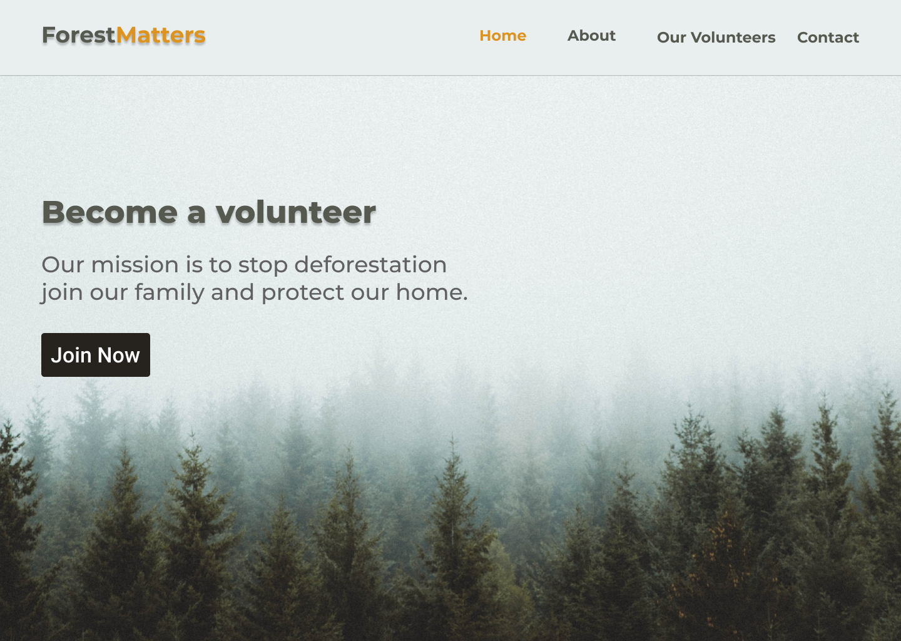
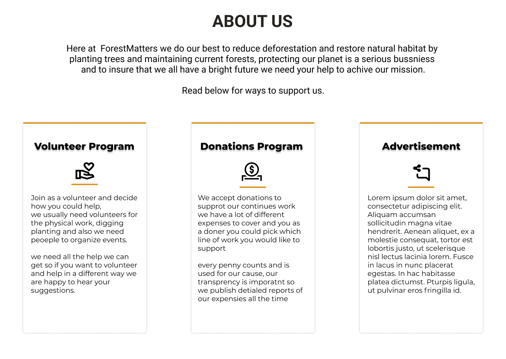
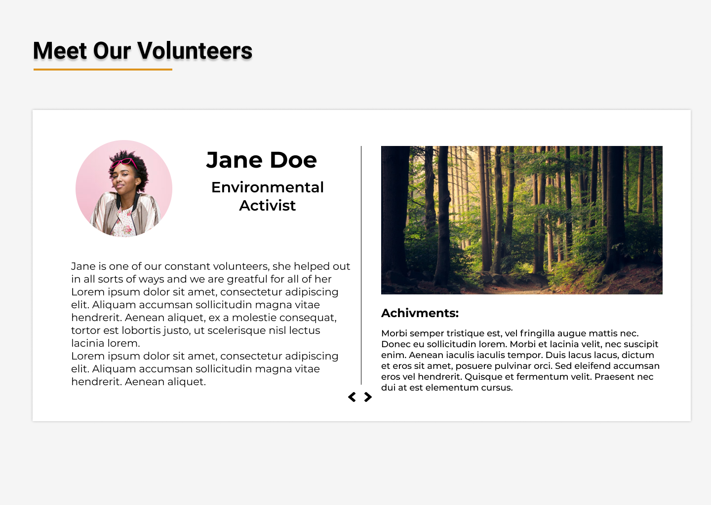
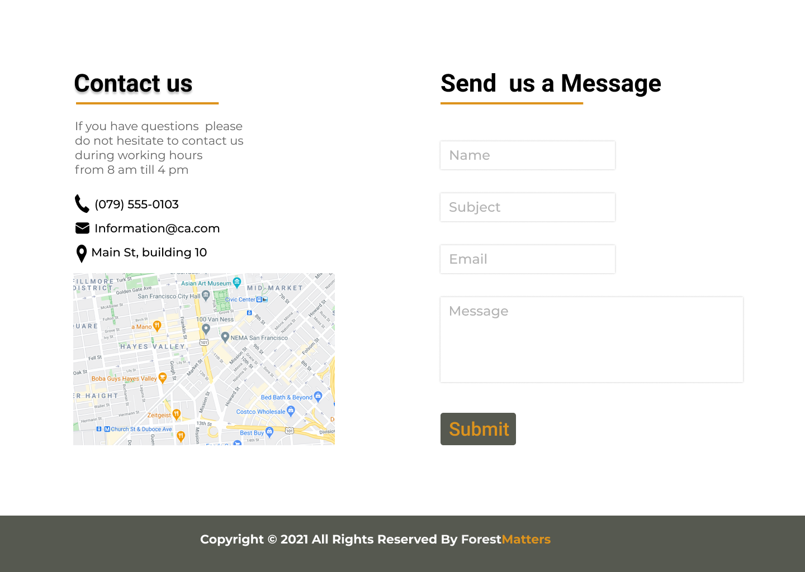

# Cascading Style Sheet Part 2 (CSS)

## High Level Goals

By the end of this lesson, you will be familiar with the following:

- Flexbox and grid
- The position CSS attribute
- Media queries

## Page Layouts

### What Is A Page Layout

A page layout is basically the design or the arrangement of the elements in the web page.

When it comes to the arrangement of elements on the screen there are multiple way to achieve that and some of these ways are the following:

- ### Float

  The float attribute is used to specify how the item should float, it has four values `left`, and `right` are used to float the item to the right or left side, `none` is the default which does not float the element and the last one is `inherit` that makes the element inherit the float values from its parent.

  ```html
  <!DOCTYPE html>
  <html>
    <body>
      <button id="b1">left</button>
      <button id="b2">right</button>
    </body>
  </html>
  ```

  ```css
  #b1 {
    /* the element will float to the left side */
    float: left;
  }
  #b2 {
    /* the element will float to the right side */
    float: right;
  }
  ```

- ### Position

  The position property is used to position an element on the screen and there are five different position values which are the following:

  Examples on position property:

    <details>
      <summary>
        Static:
      </summary>
      position `static` is the default value for the position property and what it does is that it displays the element in the normal way it should be and it cannot be be effected by other attributes like `top`, `right`, `bottom`, and `left`.

  ```html
  <!DOCTYPE html>
  <html>
    <body>
      <div>0</div>
      <div id="div1">1</div>
      <div id="div2">2</div>
      <div id="div3">3</div>
    </body>
  </html>
  ```

  ```css
  /* base style for divisions */
  div {
    height: 100px;
    width: 100px;
    background-color: red;
  }

  /* all divisions below will be shown in the same way */
  #div1 {
    /* no need to add the position attribute since `position: static` the default for all elements */
  }

  #div2 {
    /* nothing will change when adding position static since it is the default */
    position: static;
  }

  #div3 {
    position: static;
    /* the element cannot be moved using `top` and `right` */
    top: 100px;
    right: 100px;
  }
  ```

    <hr>
    </details>

    <details>
      <summary>
        Relative:
      </summary>
    position `relative` positions the element in relation to it's normal position, meaning it will be the same as `static` if not moved and when using `top`, `right`, `bottom`, and `left` the element would move in relation to its original position.

  ```html
  <!DOCTYPE html>
  <html>
    <body>
      <div id="div4">4.A</div>
      <div id="div5">5</div>
      <div id="div4">4.B</div>
    </body>
  </html>
  ```

  ```css
  /* base style for divisions */
  div {
    height: 100px;
    width: 100px;
    background-color: red;
  }

  #div4 {
    /* nothing will change when adding position relative by it self since it will stay in the same original position */
    position: relative;
  }

  #div5 {
    position: relative;
    /* the attributes below will move the div with the specified amount, they will move it depending on its original position
    top will move it down 100px from the original position and right will move it to the left 100px */
    top: 100px;
    right: 100px;
  }
  ```

    <hr>
    </details>

    <details>
      <summary>
        Fixed:
      </summary>
      position `fixed` positions the element in relation to the viewport and it stays the same position even if the page is scrolled.

  ```html
  <!DOCTYPE html>
  <html>
    <body>
      <div id="div6">6</div>
    </body>
  </html>
  ```

  ```css
  #div6 {
    /* the element will be pinned to the top of the screen and will stay there even when scrolling down */
    position: fixed;
    top: 0;
  }
  ```

    <hr>
    </details>

    <details>
      <summary>
        Absolute:
      </summary>
      position `absolute` positions the element in relation to the nearest positioned (having a position other than static) ancestor and if there were no positioned ancestor then it gets positioned in relation to the document body.

  ```html
  <!DOCTYPE html>
  <html>
    <body>
    <h1> Title </h1>
    <div id="parent1">
      <div id="child1"><div>
    <div>
    <div id="parent2">
      <div id="child2"><div>
    <div>
    </body>
  </html>
  ```

  ```css
  div {
    height: 200px;
    width: 200px;
  }

  #parent1 {
    /* since the parent is positioned then the absolute child will be positioned depending on the parent*/
    margin-top: 50px;
    position: relative;
    height: 800px;
    width: 800px;
  }

  #child1 {
    /* will position the element to the nearest positioned ancestor */
    position: absolute;
    background-color: red;
    /* this will pin it to the top of the parent div */
    top: 0;
  }

  #parent2 {
    margin-top: 50px;
    height: 800px;
    width: 800px;
  }

  #child2 {
    /* will position the element to the nearest positioned ancestor but since there is none it will default to
  the document body */
    position: absolute;
    background-color: red;
    /* this will pin it to the top of the document */
    top: 0;
  }
  ```

    <hr>
    </details>

    <details>
      <summary>
        Sticky:
      </summary>
      position `sticky` positions the element in relation to scroll position, it acts like a mix between `relative` and `fixed` positions in the sense that it acts as relative until the item reaches a specified position in the viewport while scrolling then it acts as a `fixed` item as long as the element is still in touch with that specific position .

  ```html
  <!DOCTYPE html>
  <html>
    <body>
    <h1> Title </h1>
    <p> Lorem ipsum dolor sit amet, consectetur adipiscing elit.</p>
    <div id="sticky"><div>
    </body>
  </html>
  ```

  ```css
  div {
    height: 200px;
    width: 200px;
  }

  #sticky {
    /* the division will stay in its original position below the header and paragraph until the user scrolls and the top of the division will 
    be at the top of the viewport then it will stick to that position if the user keeps scrolling down, when the user scrolls up and goes past the point were the element touched the top of the screen then it should return back to relative position */
    position: sticky;
    /* since top is at 0 that's why the element must touch the top of the screen to stick, if the value was 100px then it must reach 100px below the top and then sticks there */
    top: 0;
  }
  ```

    <hr>
    </details>

- ### Flexbox

  Flexbox layout module is used to create responsive and flexible layout structures without the use of positions and floats, even though flexbox is easy to use it wouldn't replace position and float completely.

  Flex by default makes the children inline items and orders them horizontally but that is just a part of it there are many ways of dealing with flex and bellow there will be an examples of how to use it and some of its attributes.

  ```html
  <!DOCTYPE html>
  <html>
    <head>
      <style>
        body {
          background-color: black;
          text-align: center;
          color: #fff;
        }

        .parent {
          height: 500px;
          background-color: rgba(101, 127, 185, 0.787);
        }

        .child {
          background-color: rgba(0, 41, 138, 0.787);
          border: 5px solid rgb(197, 89, 0);
          font: 1.3em sans-serif;
          font-weight: bold;
        }
      </style>
      <link href="style.css" rel="stylesheet" type="text/css" />
    </head>
    <body>
      <div class="parent">
        <div class="child child1">Child-One</div>
        <div class="child child2">Child-Two</div>
        <div class="child child3">Child-Three</div>
        <div class="child child4">Child-Four</div>
        <div class="child child5">Child-Five</div>
      </div>
    </body>
  </html>
  ```

  ```css
  .parent {
    /* flex orders the elements in a horizontal way by default */
    display: flex;

    /* it is possible to change the direction and make it vertical  */
    /* flex-direction: column; */

    /* gap will add will add space around the elements, it is possible to use
    row-gap or column-gap to be more specific  */
    /* column-gap: 10px; */
    /* row-gap: 10px; */
    gap: 20px;

    /* wrap will fit as many children as possible on the screen till it reaches the end then
    it will add another row or colum depending on the flex-direction */
    flex-wrap: wrap;

    /* justify-content is responsible for the item alignment inside the flex container
    (depending on the direction) */
    /* justify-content: center;  */
    /* justify-content: flex-end; */
    /* justify-content: flex-start; */
    /* justify-content: space-between; */
    /* justify-content: space-around; */
    /* justify-content: space-evenly; */

    /* align-items is responsible for the item alignment inside the flex container
    (depending on the opposite flex-direction) */
    /* align-items: center; */
    /* align-items: flex-end; */
    /* align-items: flex-start; */
    /* align-items: stretch; */
  }

  .child1 {
    min-height: 100px;
    width: 150px;
    /* prevents the shrinking of the item */
    /* flex-shrink: 0; */
    /* align-self is used to align a child in a way different than the parent's alignment */
    /* align-self: flex-end; */
  }

  .child2 {
    min-height: 150px;
    width: 150px;
    /* align-self: center; */
  }

  .child3 {
    min-height: 200px;
    width: 150px;
    /* flex-grow makes a child take what's left of free space, if there is only one with it then i will take all the free
    space and if there are multiple children with flex-grow then it  will divided depending on the values */
    /* flex-grow: 1; */
  }

  .child4 {
    min-height: 250px;
    width: 150px;
    /* flex-grow: 1; */
  }

  .child5 {
    min-height: 300px;
    width: 150px;
    /* flex-grow: 2; */
  }
  ```

- ### Grid

  Grid layout module is used to create a grid-based layout with rows and columns, similarly to flexbox it is used instead of position and float to design a grid layout.

  ```html
  <!DOCTYPE html>
  <html>
    <head>
      <style>
        body {
          background-color: black;
          text-align: center;
          color: #fff;
        }
        .parent {
          height: 500px;
          /* background-color: rgba(101, 127, 185, 0.787); */
        }
        .child {
          background-color: rgba(0, 41, 138, 0.787);
          border: 5px solid rgb(197, 89, 0);
          font: 1.3em sans-serif;
          font-weight: bold;
        }
      </style>
      <link href="style.css" rel="stylesheet" type="text/css" />
    </head>

    <body>
      <h1>Parent</h1>
      <div class="parent">
        <div class="child child1">Child-One</div>
        <div class="child child2">Child-Two</div>
        <div class="child child3">Child-Three</div>
        <div class="child child4">Child-Four</div>
        <div class="child child5">Child-Four</div>
      </div>
    </body>
  </html>
  ```

  ```css
  .parent {
    /* grid is used to order elements in a horizontal and a vertical way (two dimensional grid) */
    display: grid;

    /* it is possible to define the number and the size of the columns by using grid-template-columns */

    /* creating 3 columns with different sizes */
    /* grid-template-columns: 100px 200px 300px; */

    /* creating 4 100px columns */
    /* grid-template-columns: repeat(4, 100px); */

    /* diving the screen into 4 fractions so each fraction is equivalent to a quarter (25%) of the available space */
    /* grid-template-columns: 1fr 1fr 2fr; */

    /* it is possible to define the size of the row by using grid-template-rows */

    /* first row is 100px tall and the second is 200px */
    /* grid-template-rows: 100px 200px; */

    /* divides the free remaining vertical space into 3 thirds, each fraction is a third  */
    /* grid-template-rows: 1fr 2fr; */

    /* grid-auto-rows will set all the undefined rows to default to its value */
    /* grid-auto-rows: 100px; */

    /* gap will add will add space around the elements, it is possible to use 
    row-gap or column-gap to be more specific  */
    /* row-gap: 25px; */
    /* column-gap: 25px; */
    /* gap: 25px; */

    /* justify-content is responsible for the alignment of the grid items */
    /* justify-content: center; */
    /* justify-content: end; */
    /* justify-content: start; */
    /* justify-content: space-between; */
    /* justify-content: space-around; */
    /* justify-content: space-evenly; */

    /* align-items is responsible for the item alignment of the items inside each column */
    /* align-items: center; */
    /* align-items: end; */
    /* align-items: start; */
    /* align-items: stretch; */
  }

  .child1 {
    /* align-self: end;  */
  }

  .child2 {
    /* align-self: center; */
  }
  ```

- ### Media Query

  Media Queries are used to display different CSS depending on a condition, so it is really helpful when creating responsive designs.

  Media Queries enable creating a site with different CSS depending on the size of the device, when it comes to designing websites it is always a good practice to design for mobile first (smallest screen) then do versions for tablets and desktops.

  Mobile design is usually vertical rather than horizontal and the reason why it is a good practice for your code to be for small screen sizes by default is that assuming the media query did not work it will not effect the user experience by much since vertical layouts are still decent with big screens while in the contrary horizontal layouts are not user friendly and wouldn't look good with a small screen.

  ```css
  /* @media is the keyword used to create media queries */

  /* the following media query works on all device (screen, print, speech ) 
  and the condition is about the max width
  */
  @media all and (max-width: 800px) {
    .parent {
      /* depending on the condition the parent and child will have the following attributes */
      grid-template-columns: repeat(3, 200px);
      justify-content: center;
    }
    .child {
      height: 150px;
      color: rgb(255, 255, 0);
    }
  }
  ```

  ```css
  /* if there is no device type specified then the default will be all */
  @media (max-width: 500px) {
    .parent {
      grid-template-columns: repeat(2, 200px);
    }
    .child {
      color: rgb(255, 0, 0);
    }
  }

  /* Will override the media query since it came after it*/
  .child {
    color: rgb(0, 0, 0);
  }
  ```

  ```css
  /* the condition depends on the orientation of the screen, landscape is when the width of the screen is larger than the height of it*/
  @media (orientation: landscape) {
    .child {
      color: rgb(0, 255, 0);
    }
  }

  /* portrait is when the height of the screen is larger than the width, like phones */
  @media (orientation: portrait) {
    .child {
      color: rgb(255, 0, 255);
    }
  }
  ```

  ```css
  /* it is possible create an `and` condition */
  @media (orientation: landscape) and (max-height: 600px) {
    .child {
      color: rgb(0, 255, 0);
    }
  }

  /* the comma represent an `or` statement */
  @media (orientation: landscape), (max-height: 600px) {
    .child {
      color: rgb(255, 255, 0);
    }
  ```

  ```css
  /* changes the body color to red when trying to print the content */
  @media print {
    body {
      color: rgb(255, 0, 0);
    }
  }
  ```

### Practice

1. Using HTML and CSS recreate to the best of your abilities the following designs:

- First create a hero section, search about how to add an image as a background for a `div` to create a similar section and for the image it self it doesn't have to be the same.
  

- Second create an about us section, to use icons easily do the following:

  - Add the following tag to the `head` tag in the html file `<link href="https://cdn.jsdelivr.net/npm/bootstrap@5.0.0-beta3/dist/css/bootstrap.min.css" rel="stylesheet" integrity="sha384-eOJMYsd53ii+scO/bJGFsiCZc+5NDVN2yr8+0RDqr0Ql0h+rP48ckxlpbzKgwra6" crossorigin="anonymous">`
  - Check this [link](https://icons.getbootstrap.com/#icons) to search for the icon you would like to use, it doesn't have to be the same icons so any placeholder icons could suffice.
  - Click on the icon that you would like to use, then copy the `svg` tag in the copy HTML section on the right side and paste it in the HTML file to use it.
    

- Third create the volunteers section, the icons in the middle are just for ascetics, it is not going to have any functionality also feel free to use any pictures you would like.
  

- Finally create a contact form, use this [link](https://google-map-generator.com/) to generate a map to embed in the HTML file, after you generate the code just copy it and paste it directly into the HTML page.
  
