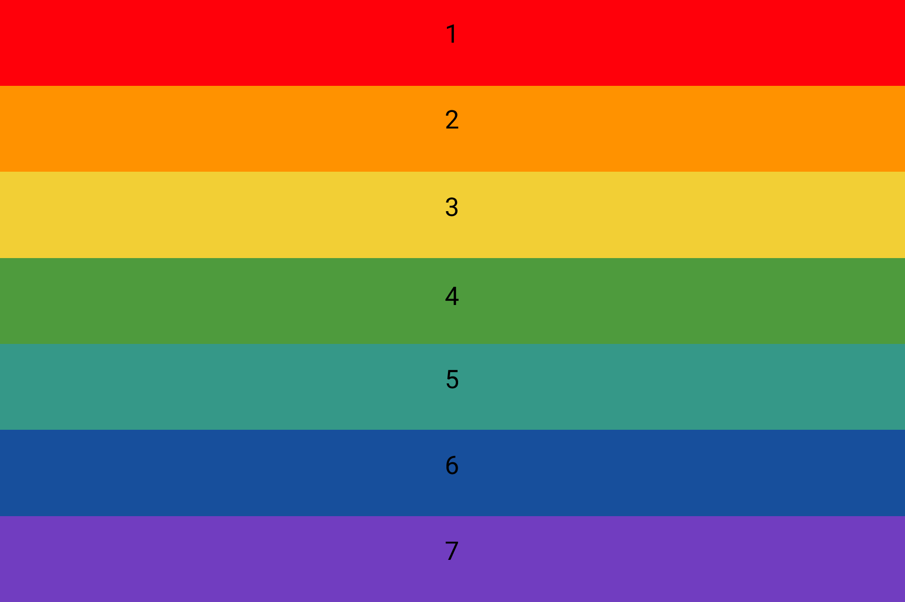
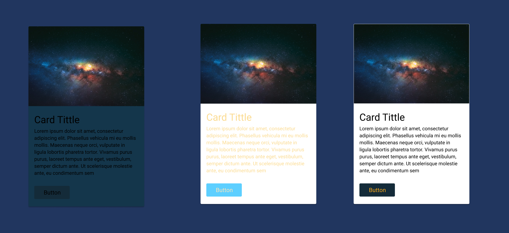
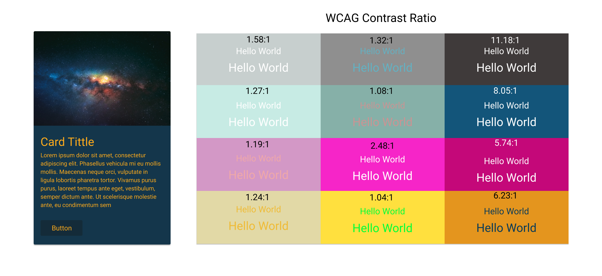
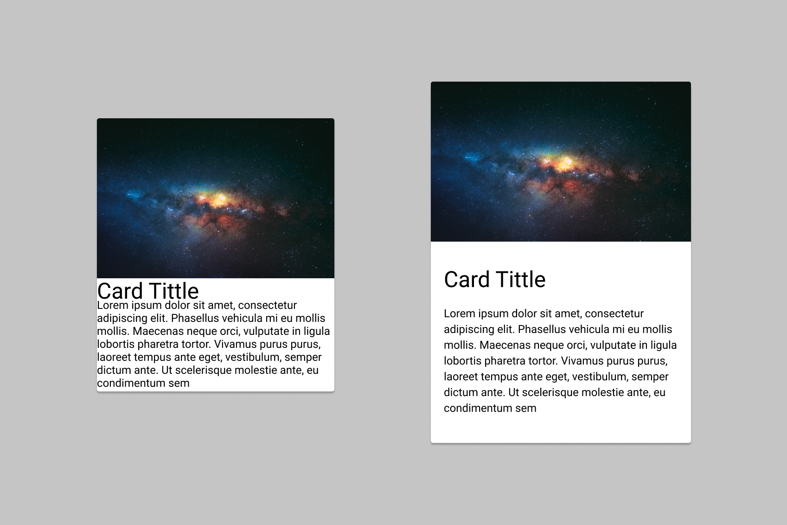
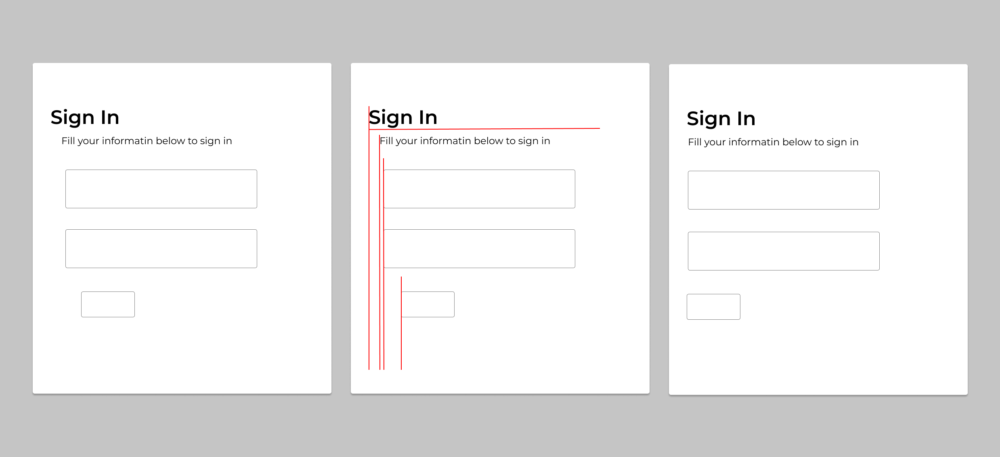
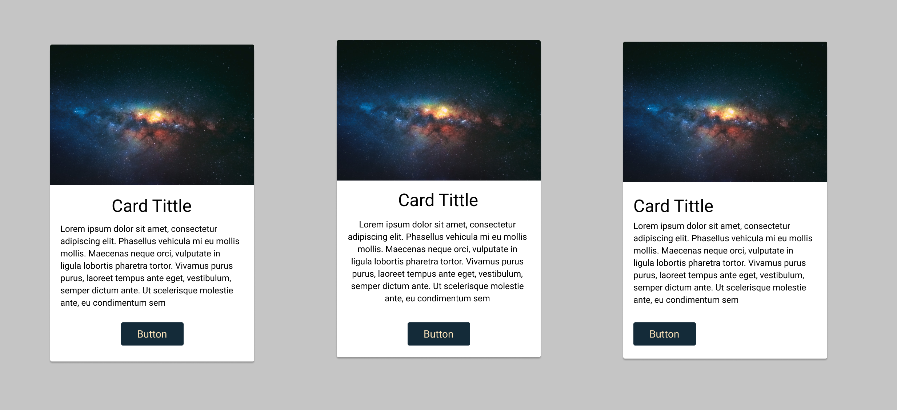
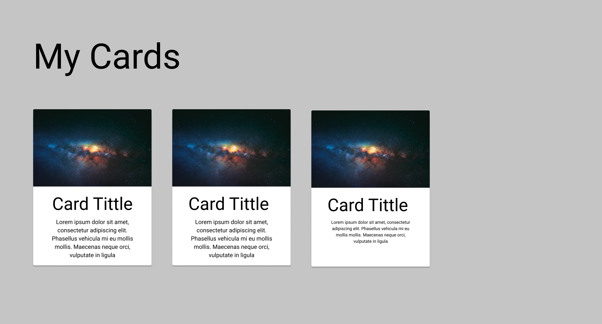
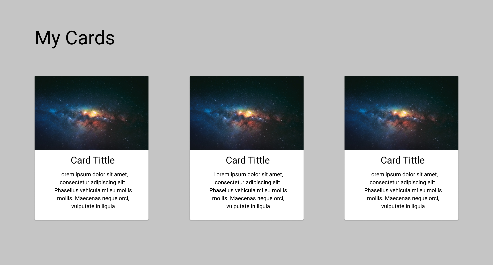
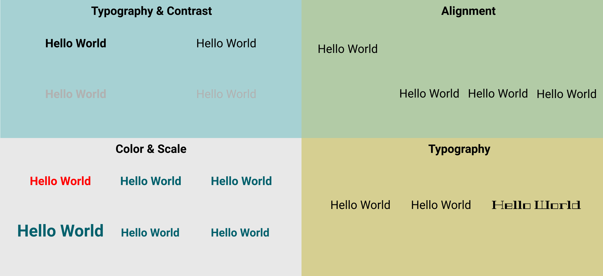

# Design Fundamentals

## High Level Goals

By the end of this lesson, you will be familiar with the following:

- UI
- UX
- Design Fundamentals

## User Interface (UI)

A user interface is what allows a human to interact with a machine, user interface is a broad term that can apply to all sorts of inputs that help a user to interact with a machine, here are some examples on UIs

- Mouse and Keyboard: used to input commands
- Display Screens: used to display information
- Microphone and Speakers: used for input and output of audio
- Applications: used to do specific operations
- Computer case: Power button, USB ports, etc
- Web Applications: Design

### UI In Web Dev

When it comes to web development when we use UI it means the website layout, colors, typography, etc.

There are some rules that are used to create a good UI and usually when followed it could fix any bad design.

## User Experience (UX)

User experience is about the experience of the user when dealing with digital or physical, the better the experience with the product the more the users will be willing to deal with the same product, it would also result in having customer loyalty which in return increases sales.

User experience focuses on how the user will feel about the product whether it was digital or physical we could still apply the same principles, and below are some of the main focus points when it comes to UX design in general:

- Usability: how easy is it to use the product, the more intuitive the better
- Usefulness: how well the product is fulfilling the user needs
- Desirability: how appealing the product is, if the product seemed complicated and hard to use users will be less likely to try it out
- Accessibility: how accessible the product by users with disabilities
- Findability: how easy is it to find what the user is looking for
- Credibility: how credible the information/product is, usually credibility is connected to aesthetics
- Valuable: how valuable the product is, is it adding a value to the user, are all the steps before valuable for the user

## Web Development Design Fundamentals

Creating a stunning UI can take a lot of creativity but there are some constants in the world of design, some rules and guidelines to create good designs.

Designing a user interface for websites

- ### Color

  Color is one of the most important aspects in the design fundamental since it is usually the first thing seen, it also conveys meanings and that is why certain bushiness tend to have matching colors.

  When it comes to picking a color palette for website use three to four colors at max and pick the colors depending rules such as complimentary, monochromatic, etc.

  Check out this [website](https://color.adobe.com/create/color-wheel) to help you choice colors based on primary color that you set, Keep in mind that there are some attention seeking colors like shown in the picture below so make sure to use the colors in the right way to guide the user rather than confusing the user.

  

- ### Contrast

  Contrast is defined as being different state or opposite (dark & light) from another thing and it mainly is comparison of the element and its surroundings like the background, contrast is usually has to do with colors.

  When creating elements make sure to use the web content accessibility guidelines (WCAG) for color contrast, use this [link](https://coolors.co/contrast-checker/ffffff-000000) to check the color contrast rating.

  
  

- ### White Space

  White Space is the empty space around the elements in the UI (also known as negative space).
  

- ### Alignment

  Alignment is positioning the element in relation to the other elements in the UI, each element in the UI defines a reference point in the shape of columns and rows.

  
  

- ### Scale

  Scale is all about the size of elements, scale can be used to make elements more visible and it can be used to control the white space when it comes to using scale it needs to be used in a way that everything has the right scale in relation to the surroundings while keeping things clear and desirable for the user.

  
  

- ### Typography

  Typography is everything that has to do with font it can effect all the other six design fundamentals depending on the side, type, weight, spacing, height, alignment etc.

- ### Visual hierarchy

  Visual Hierarchy is the most important of the rules since it utilize all previously mentioned design rules to signify importance for some elements since not all elements are as important.

  Visual hierarchy is used to guide the users eyes to specific sections on the page, the faster the use has an idea what is needed to be done and managed to understand the idea of the website faster the better the user experience

  
