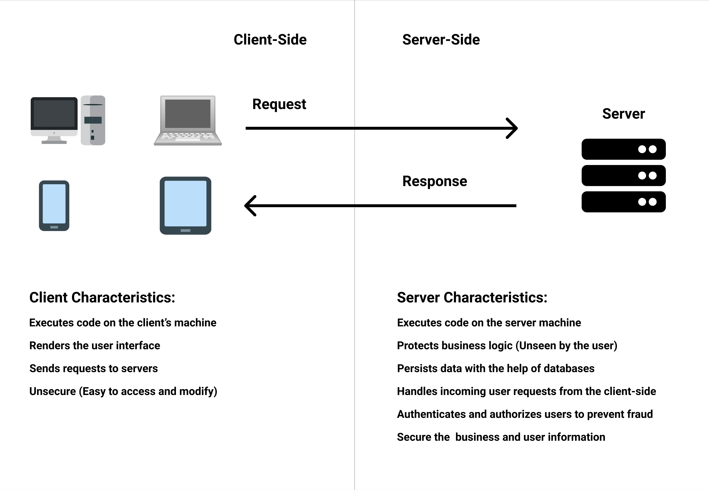

# Back-end Development

## High Level Goals

By the end of this lesson, you will be familiar with the following:

- Back-end development
- NodeJS
- NPM
- JSON
- ExpressJS

## What Is Back-end Development

Back-end development is the process of writing and developing code to be ran on the server side. Unlike the client-side, the server-side code doesn't run on the client's devices, rather it runs on the server that is hosting the application. Servers can be local or remote and have many types. We will mostly be using servers to accept requests from the client, handle these requests, and to connect the various parts of our application such as the client-side and the database.

There are many languages and frameworks that are used to develop servers. In this course we will be learning NodeJS.



## NodeJS

NodeJS is an asynchronous event-driven JavaScript runtime environment that is used to build scalable applications. In other words, NodeJS enables JavaScript to be used in the back-end.

We will be using NodeJS to listen to some asynchronous events (client-side requests). As an example, have you ever wondered what happens after you login to some website? Basically the client side will send an HTTP request with the information provided by the user to the server which can be made using NodeJS or other programming languages like Python. After the server receives the request, it will handle it and in the case of logging in it will query some information from the database and compare both of the passwords after decrypting the saved one. Assuming the process is all good and the user is an actual valid user, then it will send a response back to the client-side that will indicate that the login has succeeded.

### NodeJS Instillation

In order to download NodeJS use the following link [https://nodejs.org/en/download/](https://nodejs.org/en/download/). After the download is finished, open the file to install NodeJS.

### Using NodeJS

In order to use NodeJS open the command line (any of the following: `command prompt`, `git bash`, `terminal`, `powershell`, etc.) and type in `node` then press enter. Now it is possible to type and execute JavaScript code in the command line. To exit or stop node press `ctrl + c` twice.

NodeJS can also execute JS files by typing in `node` followed by the name of the file such as `node main.js`.

### NodeJS Package Manager (NPM)

NodeJS has an ecosystem of Node-based tools that can be used to automate parts of the application and can be used to do various tasks in general. You can use NPM to access these community based packages. NPM is installed alongside NodeJS and can be used directly from the command line.

### Using NPM

In order to manage our package, open the terminal, navigate to the desired folder, and type `npm init -y`. This command will initialize a `package.json` file that will be used to keep track of our packages.

In order to install a package you will need to type in the command line `npm install package-name` or `npm i package-name`. Check out the following documentation for more information on what NPM can do [https://docs.npmjs.com/cli-documentation/](https://docs.npmjs.com/cli-documentation/). To install all of the packages that are in the `package.json` file, use `npm install` in the same directory.

### JSON

JavaScript Object Notation (JSON) is a lightweight data format for storing and transporting data on the internet, JSON is has similar structure to Objects in JavaScript and that makes it readable even though it has the same structure it has different rules such as all strings (keys or values) should have double quotes around them also another important rule would be that it shouldn't have any trailing commas.

Use this [website](https://jsonformatter.curiousconcept.com/) to validate and format JSON data

an example of JSON:

```json
{
  "name": "john",
  "age": 25,
  "children": ["jane", "mark"],
  "job": {
    "position": "software engineer",
    "salary": 700
  }
}
```

Handling JSON in javaScript:

```js
// we can turn the following array into JSON format by using the JSON.stringify
const stringifiedArray = JSON.stringify([1, 2, 3]);
stringifiedArray; // => "[1,2,3]"

// to turn back the stringified array back to normal you will have to parse it by using JSON.parse
const array = JSON.parse(stringifiedArray);
array; // => [1, 2, 3]
```

An example on package.json file:

```json
{
  "name": "auth",
  "version": "1.0.0",
  "description": "",
  "main": "index.js",
  "scripts": {
    "start": "node app.js",
    "dev": "nodemon app.js",
    "test": "echo \"Error: no test specified\" && exit 1"
  },
  "keywords": [],
  "author": "",
  "license": "ISC",
  "dependencies": {
    "bcrypt": "^5.0.0",
    "cors": "^2.8.5",
    "express": "^4.17.1",
    "jsonwebtoken": "^8.5.1",
    "mongoose": "^5.9.20",
    "nodemon": "^2.0.4"
  }
}
```

### NPM scripts

Notice the `scripts` section in the `package.json` file example above. This means that it is possible to run some scripts by using NPM.

To run the start script type `npm start`, to run the test script type `npm test`, and to run other custom scripts type `npm run script-name`.

## ExpressJS

### What Is ExpressJS

Express is a lightweight, minimal and flexible NodeJS framework. Check the documentation for more information on express [https://expressjs.com/](https://expressjs.com/).

### ExpressJS installation

ExpressJS can be installed using NPM by typing in the following command `npm install express`.

### Using Express

In order to use Express it first must be required or imported. In order to require a package in NodeJS you will have to use the `require` keyword with the package name such as `require('express')`. Make sure that the package is installed and is present in the node modules folder before requiring it, also in order to use express functionality we will have to save the required package in a variable `const express = require('express')`.

Here is an example of creating a basic server using express:

```js
// require express
const express = require("express");
// instantiate express
const app = express();
const port = 3000;

// run the server locally on the desired port, use the following link to open up the server http://localhost:3000`
app.listen(port, () => {
  // will log to the command line when the server starts
  console.log(`Example app listening at http://localhost:${port}`);
});
```

### Running the server

In order to run the server type `node file-name.js`, after every change the server must be stopped by pressing `ctrl + c`and ran again so the changes take effect.

Instead, we can use an NPM package called `nodemon` to automatically restart the server after every change. To install the package globally, type the following in the command line: `npm i nodemon --global`. After the installation is complete, type `nodemon file-name.js` to watch for changes and restart the server if needed.

### Important note

The goal of this lesson is to familiarizes yourself with some important terms and keywords that will be used in future lessons, so make sure to read the lesson again to have a better understanding on these new topics, the questions below will cover all the main points of the lesson along side introducing you to the npm documentation so please ask for help if you have any problems with the questions or how to use the documentation to access the needed information.

### Pulse Check

1. Install NodeJS.

2. Run NodeJS in the terminal to make sure it is installed.

3. Create the following JS file (index.js) and run it using NodeJS.

   ```js
   const a = 10;
   const b = 20;

   console.log(a + b);
   ```

4. Using NPM install the `nodemon` package globally.

5. Using NPM initialize a `package.json` in the practice folder and install the `express` package.

6. Read the following documentation [https://docs.npmjs.com/cli-documentation/](https://docs.npmjs.com/cli-documentation/) and figure our how to uninstall the `express` package.

7. Create a start script that runs `index.js` using node, and run it.

8. Create a script called `dev` that runs `index.js` using nodemon, and run it.

9. Create a script that would create a new file `server.js` using the keyword `touch`, and run it.

10. Create a basic express server in `server.js` and run it using nodemon.
