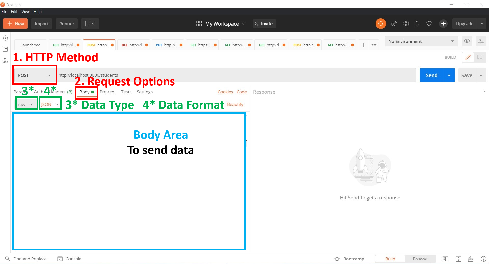

# Application Programming Interface

## High Level Goals

By the end of this lesson, you will be familiar with the following:

- The definition of APIs
- HTTP methods
- Endpoints
- Using Postman
- The definition of CRUD

## What Are APIs

Application programming interface (API) is an interface that allows one piece of software or hardware to communicate with another piece of software or hardware. In the world of web development this communication is structured around requests and responses. As an example of what an API would be like, imagine yourself in a restaurant and you want to order some food. The food is prepared in the kitchen so in order for you to get the meal you want to eat, you will have to speak to the waiter which is like our API. We would give a request which is the kind of meal we want, then the waiter would take that information and deliver it to the kitchen so the chefs can prepare the meal. Then whenever the meal is ready, the waiter will send a response which is the meal and deliver it back to you. APIs are what allows us to access the application, some benefits of using APIs include accessing information, hiding application complexity, extending new functionality and security, etc.

We will be using APIs to send requests from the client-side and get back responses from the server-side.


### RESTful APIs

RESTful APIs are the APIs that are following the REST pattern. REST stands for representational state transfer and it is an architecture style used for designing networked applications and it relies on HTTP requests. There are different types of HTTP requests and these types are connected to the HTTP method that is used in creating the request here are some of the most used HTTP methods:

- GET: used to retrieve data from a specified resource, like a server.
- POST: used to submit data to the specified resource.
- PUT: used to update data from the specified resource.
- DELETE: used to delete data from the specified resource.

There are other less used HTTP methods such as HEAD, PATCH, OPTIONS, etc.

To create a RESTful API you need to combine an HTTP method with an endpoint. An endpoint is basically the URL/URI of the specified resource and it would look something like `https://www.ourwebsite.com/create/user`, here are some more information about urls.


## Postman

Postman is a platform for API development that we will be using to send and receive requests to our servers, click [here](https://www.postman.com/downloads/) to download the app.

### Using Postman




## CRUD Operations with Express

CRUD stands for Create, Read, Update, Delete, and these operations can be made with the POST, GET, PUT, and DELETE HTTP methods.

When creating an API endpoint in express the HTTP method and URL endpoint must be provided alongside the callback function that will be executed if the server receives a request to that specified HTTP method and endpoint. The callback will have access to two parameters, `request` and `response`. The `request` parameter allows us to access the received information and the `response` parameter enables us to send a response back to the client-side. When sending the `response`, there are other values to send back as a response such as [status codes](https://developer.mozilla.org/en-US/docs/Web/HTTP/Status) and other types of headers.

An example of creating an API endpoint in express:

```js
const express = require("express");
const app = express();
const port = 3000;

// a middleware that enables us to read the received JSON data
app.use(express.json());

const users = [
  { name: "John", age: 25 },
  { name: "Jane", age: 20 },
  { name: "Mark", age: 19 },
];

// a GET request on endpoint http://localhost:3000/users
app.get("/users", (req, res) => {
  // set the response status code to 200 (OK)
  res.status(200);
  // sends back a response of all users
  res.json(users);
});

// a GET request on endpoint http://localhost:3000/user?name=John
app.get("/user", (req, res) => {
  const user = req.query.name

  const found = users.find((element) => {
    return element.name === user;
  });

  if (found) {
    // set the response status code to 200 (OK)
    // sends back a response of the found user
    res.status(200);
    res.json(found);
  } else {
    // set the response status code to 404 (Not Found)
    res.status(404);
    res.json("User not found");
  }
});

// a GET request on endpoint http://localhost:3000/user/John
app.get("/user/:name", (req, res) => {
  const user = req.params.name

  const found = users.find((element) => {
    return element.name === user;
  });

  if (found) {
    // set the response status code to 200 (OK)
    // sends back a response of the found user
    res.status(200);
    res.json(found);
  } else {
    // set the response status code to 404 (Not Found)
    res.status(404);
    res.json("User not found");
  }
});

// a POST request on endpoint http://localhost:3000/create/user
app.post("/create/user", (req, res) => {
  // the received information are in req.body
  // an example of the sent data would be { "name": "John", "age": 25}
  const newUser = { name: req.body.name, age: req.body.age };
  // same as the above but in ES6
  // const { name, age } = req.body;

  // add the new user to the users array
  users.push(newUser);
  // same as above but in ES6
  // users.push({ name, age });

  // set the response status code  to 201 (Created)
  res.status(201);
  // sends back a json response of the added user
  res.json(newUser);
  // same as above but in ES6
  // res.json({ name, age })
});

app.listen(port, () => {
  console.log(`Example app listening at http://localhost:${port}`);
});
```

### Pulse Check

1. Using the example code above run the server and make a GET request using Postman to retrieve the users.

2. Using Postman make a get request to get the user called `Mark`, then try it out with a user that doesn't exist in the `users` array.

3. Using Postman make a post request to create a new user, make sure to open the `body` tab to send raw JSON data (The data must be in JSON format).

4. Create a new endpoint `first-user` that would return the first user in the array and test it out using Postman.

5. Create a new endpoint `/` with the method of GET, return a response of `hello world` and open the following link `http://localhost:3000/`. Explain what happens when you open the API endpoint in the browser.

### Practice

1. Create a new server `app.js` and run it.

2. In the global scope create an array `const todos = [{ todo: " wake up", isCompleted: false }, { todo: "Eat Breakfast", isCompleted: false }];`.

3. Create an API to handle a GET request to the endpoint `/todos` that sends a response of all todos in the `todos` array.

4. Create an API to handle a POST request to the endpoint `/create/todo` that adds the new todo object to the `todos` array then sends a response of the newly added todo.

5. Create an API to handle a PUT request to the endpoint `/update/todo/:name` that updates the matched todo object then sends a response of the of the newly updated todo object.

   HINT: Send the new data in the request body while in the params send the query to find the user, use expressjs main [documentation](https://expressjs.com/en/4x/api.html#app) to read more about PUT request.

6. Create an API to handle a DELETE request to the endpoint `/delete/todo/:name` that deletes the matched todo object then sends a response of the of the deleted todo object.

   HINT: Use expressjs main [documentation](https://expressjs.com/en/4x/api.html#app) to read more about DELETE request.

7. Create an API to handle a PUT request to the endpoint `/complete/todo/:name` that sets `isCompleted` to `true` for the matched todo object.

8. Create an API to handle a GET request to the endpoint `/completed/todos` that sends back a response of all the completed todo Objects.
