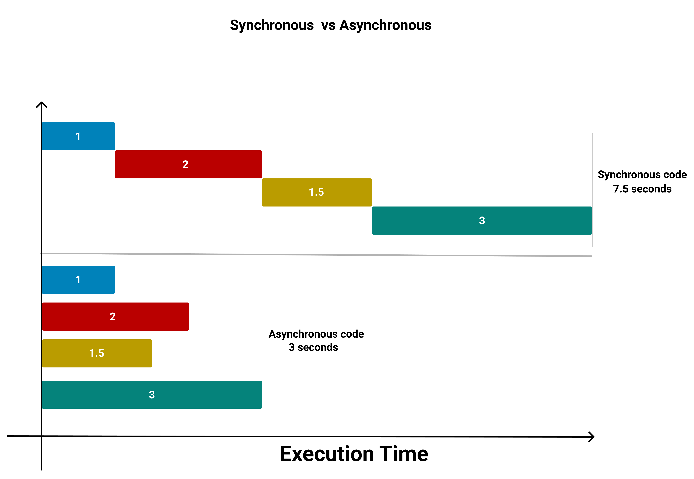

# Asynchronous Programming

## High Level Goals

By the end of this lesson, you will be familiar with the following:

- The definition of asynchronous code
- File system module
- Promises
- Async/await
- Callback Hell

## Synchronous VS Asynchronous

JavaScript executes code synchronously from top to bottom and executes every line before going to the next line. So synchronous
code executes immediately then goes to the next line, whilst asynchronous code needs some time to execute. Since JavaScript executes code synchronously, when it fasces some asynchronous code it will run it then continue executing the rest of the code without getting the value of that asynchronous code. some examples on asynchronous code we have seen before are `setInterval` and `setTimeout`. JavaScript can handle that kind of code by using callbacks so the code will continue executing normally in a synchronous way and whenever the asynchronous code is ready it will be ran separately.

There are three main ways in Node to handle asynchronous code, `callbacks`, `promises`, and `async/await`. In this lesson we will be exploring some uses for asynchronous code in Node as well as learning how to read and write files and use external APIs.



## Callbacks

Callbacks can be used to access the value of an asynchronous operation, keep in mind that the value only exist inside the callback scope.

### Node File System

The NodeJS built-in file system `fs` module is used to enable interactions with the file system. It is mostly used to: read, write, update, delete and rename files.

An example using the file system with callbacks:

```js
// require the builtin file system module to use it in our application
const fs = require("fs");

let content;
// using the readFile method to read the content of list.txt (in the same directory)
// in Node the convention with callbacks is that errors are the first parameter
fs.readFile("list.txt", (err, data) => {
  if (err) throw err;
  content = data.toString();
  console.log(content);
});

// since the synchronous code will execute before the asynchronous one then at the moment of execution
// content is still undefined and at a later time it got assigned a new value
console.log(content); // => undefined

fs.writeFile("new-file.txt", "Hello World", (err) => {
  if (err) throw err;
  console.log("The file has been saved");
});
```

## Promises

A Promise is an object that represents the eventual completion or failure of an asynchronous operation. For this lesson we will not dive deeply on how to create a promise but on how it is used in Node, mainly with external APIs.

Check the [link](https://developer.mozilla.org/en-US/docs/Web/JavaScript/Reference/Global_Objects/Promise) to know more about promisees in javaScript.

### External APIs

We will be using an NPM package called `axios` to send requests to other servers. In this case we will be sending requests to the [JSONPlaceholder](https://jsonplaceholder.typicode.com/guide/). Read the documentation to know how to handle their APIs, many websites have APIs to enable other servers to communicate and get specific information like getting the location or weather status. When dealing with these APIs you must send a request in the format that the API accepts and that's why it is important to read the documentation of the API before using it.

An example on promises:

```js
const axios = require("axios");

// a get request to get the post with id 1
axios
  .get("https://jsonplaceholder.typicode.com/posts/1/")
  // in `.then()` we add the code for the success
  .then((response) => {
    console.log(response.data);
  })
  // in `.catch()` we add the code to handle the error
  .catch((err) => {
    throw err;
  });

// a get request to get all the comments for the post with id 1
axios
  .get("https://jsonplaceholder.typicode.com/posts/1/comments")
  // in `.then()` we add the code for the success
  .then((response) => {
    console.log(response.data);
  })
  // in `.catch()` we add the code to handle the error
  .catch((err) => {
    throw err;
  });

// a get request to get all the posts
axios
  .get("https://jsonplaceholder.typicode.com/posts")
  .then((response) => {
    console.log(response.data);
  })
  .catch((err) => {
    throw err;
  });
```

### Async And Await

The keywords `async` and `await` are a part of ES8 and by using the keyword `async` before the function declaration will result in that function being turned into an asynchronous function, turning the function into a promise which would return a promise. Whereas by using the keyword `await` it pauses the execution of the async function until it gets the value of the promise. `await` must be used with async functions only.

An example on `async` and `await` used with external API:

```js
const axios = require("axios");

const getComments = async () => {
  // using try/catch for error handling
  try {
    const response = await axios.get(
      "https://jsonplaceholder.typicode.com/posts/1/comments"
    );
    console.log(response.data);
  } catch (err) {
    throw err;
  }
};

getComments();
```

An example on `async` and `await` with the file system

```js
// in order to use async and await you must change fs to become promise based like in the line below
const promiseFs = require("fs").promises;

const readFile = async () => {
  try {
    const data = await promiseFs.readFile("list.txt");
    console.log(data.toString());
  } catch (err) {
    throw err;
  }
};

readFile();
```

### Callback Hell

While using callbacks most developers could get into something called callback hell which is heavily nested callbacks. A callback hell looks like a pyramid and it is usually hard to read or debug since the code will have low readability. Below there is a small example of a callback hell, but in some cases you might find many more nested callbacks, and for that reason it is recommended to use promises or async/await instead where possible.

An example on callback hell:

```js
const express = require("express");
const {
  getUsers,
  filterUsers,
  modifyUsers_1,
  modifyUsers_2,
} = require("./utils");

const app = express();

app.get("/modified-users", (req, res, next) => {
  getUsers((err, data) => {
    if (err) res.send(err);
    filterUsers(data, (err, data) => {
      if (err) res.send(err);
      modifyUsers_1(data, (err, data) => {
        if (err) res.send(err);
        modifyUsers_2(data, (err, data) => {
          if (err) res.send(err);
        });
      });
    });
  });
});
```

### Pulse Check

1. Create the following files and install `axios`.

   1. `data.txt` file

      ```txt
      First line
      Second Line
      ```

   2. `app.js`

      ```js
      const fs = require("fs");
      const axios = require("axios");
      ```

2. Write a function `readFile` that reads the content of the `data.txt` file.

   ```js
   const readFile = () => {
     // TODO: Your code here
   };
   ```

3. Write a function `writeFile` that writes `A new file has been created` on a new file called `text.txt`.

   ```js
   const writeFile = () => {
     // TODO: Your code here
   };
   ```

4. Write a function `getPost` that takes one parameter `id` and returns the post from JSONPlaceholder API that has the passed `id`.

   ```js
   const getPost = (id) => {
     // TODO: Your code here
   };

   getPost(1);
   getPost(50);
   ```

5. Write an async function `getPostAsync` that does the same as the previous function but it must be implemented by using `async` and `await`.

   ```js
   const getPostAsync = (data) => {
     // TODO: Your code here
   };
   ```

### Practice

1. Write a function `appendToFile` that accepts one argument `data` and will append the passed argument as a new line to the `data.txt` file without writing over the content in that file. Check out this [link](https://nodejs.org/api/fs.html#fs_fs_appendfile_path_data_options_callback) from the Node JS documentation for more information.

   ```js
   const appendToFile = (data) => {
     // TODO: Your code here
   };
   ```

2. Write a function `copyFile` that accepts one argument `fileName` and it would copy the file that matches the argument to the same directory but with a modified name, `data.txt` would become `copy_of_data.txt`, it will create or overwrite copied file if exist and when it is done copying log `done` . Search the NodeJS file system [documentation](https://nodejs.org/api/fs.html) for more information.

   ```js
   const copyFile = (fileName) => {
     // TODO: Your code here
   };
   ```

   <details>
     <summary>
       Click here to get a link for the method.
     </summary>
     Try searching first if you haven't, copyFile <a href="https://nodejs.org/api/fs.html#fs_fs_copyfile_src_dest_mode_callback"> link</a>
   </details>

3. Write a function `createPost` that accepts one argument `post` and sends a post request to `https://jsonplaceholder.typicode.com/posts` then returns the newly added post, make sure to parse the response ,checkout the Axios [documentation](https://www.npmjs.com/package/axios) for more information on creating a `POST` request.

   ```js
   // the API Expects JSON data to be sent and that's why `JSON.stringify` is used
   const post = JSON.stringify({
     title: "JavaScript Basics",
     body: "This post contains information about javaScript ",
     // the id of the user who is going to create the post
     userId: 1,
   });

   const createPost = (post) => {
     // TODO: Your code here
   };

   createPost(post);
   ```

4. Write a function `updatePost` that accepts two arguments `postId` and `data`. The function should update the post from JSONPlaceholder with the passed `postId` using the new data provided, and then it should return the response after parsing. Read the JSONPlaceholder [documentation](https://jsonplaceholder.typicode.com/) to be find the endpoint and check out Axios [documentation](https://www.npmjs.com/package/axios) for more information on creating a `PUT` request.

   ```js
   const newPost = JSON.stringify({
     // the post id that we want to update, change it when trying to update another post
     id: 1,
     title: "Updated Title",
     body: "Updated body",
     userId: 1,
   });

   const updatePost = (postId, data) => {
     // TODO: Your code here
   };

   updatePost(1, newPost);
   ```

5. Write an async function `getUsers` that returns all users from JSONPLaceholder API by using `async` and `await`. Search JSONPlaceholder [documentation](https://jsonplaceholder.typicode.com/) to know how to get the users.

   ```js
   const getUsers = () => {
     // TODO: Your code here
   };
   ```

6. Write a function `saveUsers` that would save all the users from JSONPLaceholder API to a new file called `users.txt`.

   ```js
   const saveUsers = () => {
     // TODO: Your code here
   };
   ```
