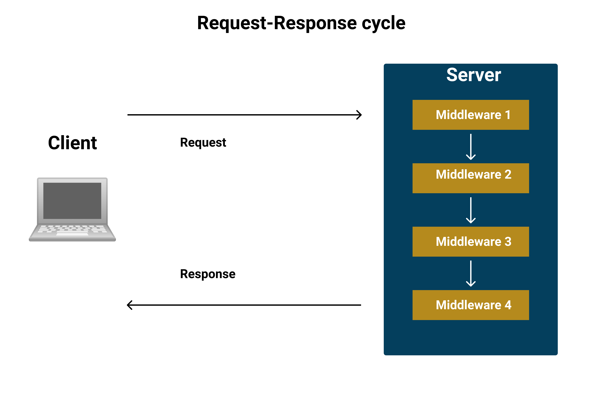
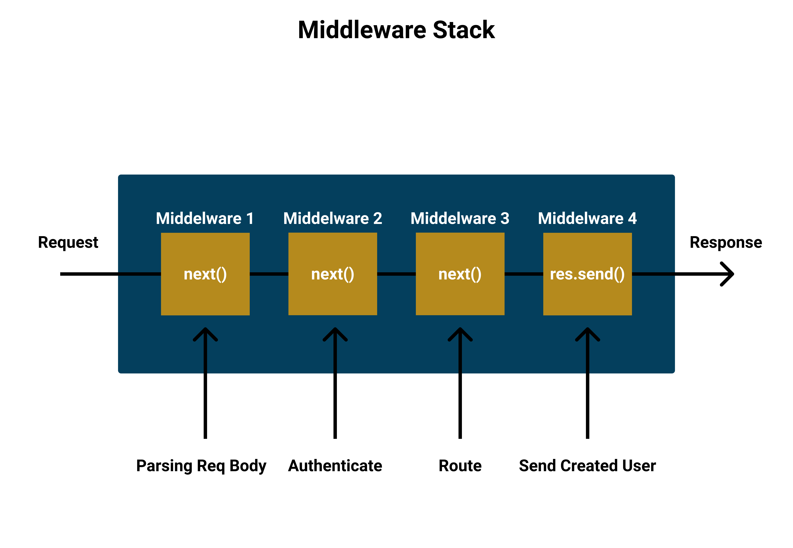

# Express Middlewares

## High Level Goals

By the end of this lesson, you will be familiar with the following:

- Express middlewares
- Application-level middlewares
- Built-in middlewares
- Router-level middlewares
- Error-handling middlewares
- Third-Party middlewares

## What Is an Express Middleware

A middleware is a function that access to the request and response objects and the next middleware in the application's request-response cycle in other words a middleware is a function that can be called before the request handling function and it is possible to chain multiple middleware functions together, to pass from one function to the next you must invoke the third parameter which is usually referred to as next otherwise if the next function isn't invoked then the request will be left hanging.



An example of a middleware:

```js
const express = require("express");
const app = express();
const port = 3000;

// this middleware function have access to three parameters:
// req: the request object
// res: the response object
// next: the next function in the request-response cycle
const ourMiddleware = (req, res, next) => {
  const name = req.body.name;

  if (name === "John") {
    // by invoking the next we will exit the function and go to the next one
    next();
  } else {
    res.send("Invalid Name");
  }
};

// we separate middlewares with commas, the invocation order will be from left to right
app.post("/create/item", ourMiddleware, (req, res) => {
  // this function will only be invoked if the one before it was invoked and it invoked the next function
  // send a response back
  res.send("test create/items endpoint");
});

app.listen(port, () => {
  console.log(`Example app listening at http://localhost:${port}`);
});
```



## Middleware Types

There are different middleware types that are used depending on the use case, here are some of the middleware types:

- Application-level middleware: is Bound on the app instance
- Built-in middlewares: builtin application-level middlewares
- Router-level middleware: is bound on the Router instance
- Error-handling middleware: these middlewares have a different function signature made of four parameters instead of three
- Third-party middleware: third-party middlewares to extend new functionality to express

### Application-Level Middlewares

Application-level middleware are bound on the application instance, it can be done by using `app.use()`

An example on application-level middlewares:

```js
const express = require("express");
const app = express();
const port = 3000;

// Every time the application receives a request this middleware function will be executed
app.use((req, res, next) => {
  console.log("Hello world");
  // next will invoke the next middleware function in the cycle
  next();
});

// This middleware will run every time the application receives any type of an HTTP requests on /users
app.use("/users", (req, res, next) => {
  // req.method is the type of HTTP method for that particular request
  console.log(req.method);
  next();
});

app.get("/users", (req, res, next) => {
  res.json("hello");
});

app.listen(port, () => {
  console.log(`Example app listening at http://localhost:${port}`);
});
```

### Builtin Middlewares

Builtin Middleware are Builtin Application-level middlewares.

An example on builtin middlewares:

```js
const express = require("express");
const app = express();
const port = 3000;

// express.static() is a middleware that serves static assets such as HTML files, images, etc
// it will read files from a folder called public in the same directory
app.use(express.static("public"));

// express.json() is a middleware that parses incoming requests with JSON payloads
app.use(express.json());

app.listen(port, () => {
  console.log(`Example app listening at http://localhost:${port}`);
});
```

### Router-Level Middlewares

The router object allows us to create an isolated instance of middlewares and routes. it is similar to the express application but capable of only performing middleware and routing functions, and to use the router it must be used as a middleware in the application.

An example on router-level middlewares:

```js
const express = require("express");
const app = express();
const port = 3000;
// insatiate router object
const authRouter = express.Router();

// a middleware function that logs the type of the HTTP method
const methodType = (req, res, next) => {
  console.log(req.method);
  next();
};

// a middleware function that will be executed for every request made to the auth router
authRouter.use((req, res, next) => {
  console.log("Test Router");
  next();
});

// a middleware that will be executed for every type of HTTP request made to the / endpoint
authRouter.use("/", (req, res, next) => {
  console.log("Another middleware");
  next();
});

// a middleware that will be executed for every POST requests to the /login endpoint
authRouter.post("/login", methodType, (req, res) => {
  res.send("Login successful");
});

// use the authentication router as an application-level middleware
// this authRouter will be called on the routes that match /auth, and in order to invoke the login, the
// endpoint must be /auth/login, and if we request that route both of the middlewares will be invoked before the login handler
app.use("/auth", authRouter);

app.listen(port, () => {
  console.log(`Example app listening at http://localhost:${port}`);
});
```

### Error-handling middleware

Error-handling middlewares are used as the name applies for error handling the only difference between it and a normal middleware is the amount of parameters.

An example on error-handling middlewares:

```js
const express = require("express");
const app = express();
const port = 3000;

app.get("/", (req, res, next) => {
  // create a new error
  const err = new Error("Internal server error");
  err.status = 500;
  // pass it to next, we only pass values to `next` when we want to call the error handling middleware
  next(err);
});

// error handling middlewares have a different function signature, they take four parameters instead of three
app.use((err, req, res, next) => {
  // set the status code
  res.status(err.status);
  // send the response in JSON format
  res.json({
    error: {
      status: err.status,
      message: err.message,
    },
  });
});

app.listen(port, () => {
  console.log(`Example app listening at http://localhost:${port}`);
});
```

### Third-Party middleware

Third-party middlewares are used to extend the functionality of express and it is usually installed using npm the used in the application.

In the example below we will be using a package called morgan `npm i morgan`.

An example on third-party middlewares:

```js
const express = require("express");
const morgan = require("morgan");
const app = express();
const port = 3000;

// morgan is used to log information in the console, by default it can long information about the incoming requests
// using morgan as an application-level middleware
app.use(morgan("default"));

app.get("/", (req, res, next) => {
  res.send("Testing endpoint");
});

app.listen(port, () => {
  console.log(`Example app listening at http://localhost:${port}`);
});
```

### Pulse Check

0. Create a new server using the code below and use it while solving the following questions, use Postman to check the answer.

   ```js
   const express = require("express");

   const app = express();
   const port = 3000;

   const users = ["John", "Mark"];

   app.get("/users", (req, res, next) => {
     res.json(users);
   });

   app.listen(port, () => {
     console.log(`Example app listening at http://localhost:${port}`);
   });
   ```

1. Create a middleware function `logUsers` that logs the `users` array then invokes the next middleware.

2. Use the middleware `logUsers` as an application-level middleware.

3. Create a middleware function `logMethod` that logs the HTTP method and use it on the `/users` route.

4. Use the right builtin middleware to parse JSON payloads from the request.

5. Create an application-level error-handling middleware that will be called if the `users` array is empty,the middleware should have the message `No users`, empty the array to test it out.

### Practice

1. Create a new express router to handle all requests to `/users`, and use it in the application, the endpoint `/users` should return all users.

2. Add a new route `/users/create` that will add a new user to the `users` array, and create a middleware that will log the request body if found (use the correct HTTP method).

3. Create a new express router to handle all requests to `/products` then use it in the app.

4. Create a `products` array that has the following items `keyboard`, `mouse` and then add a route to update the items `/products/update` in the array, it should replace one of the values with the new value.

5. Create a new router-level middleware attached on the products router that will log the `products router` at every HTTP request.

6. Create an application-level error-handling middleware, that has the message of `NOT FOUND` and a status code of `404` and that will be called when trying to access an unassigned endpoints.
