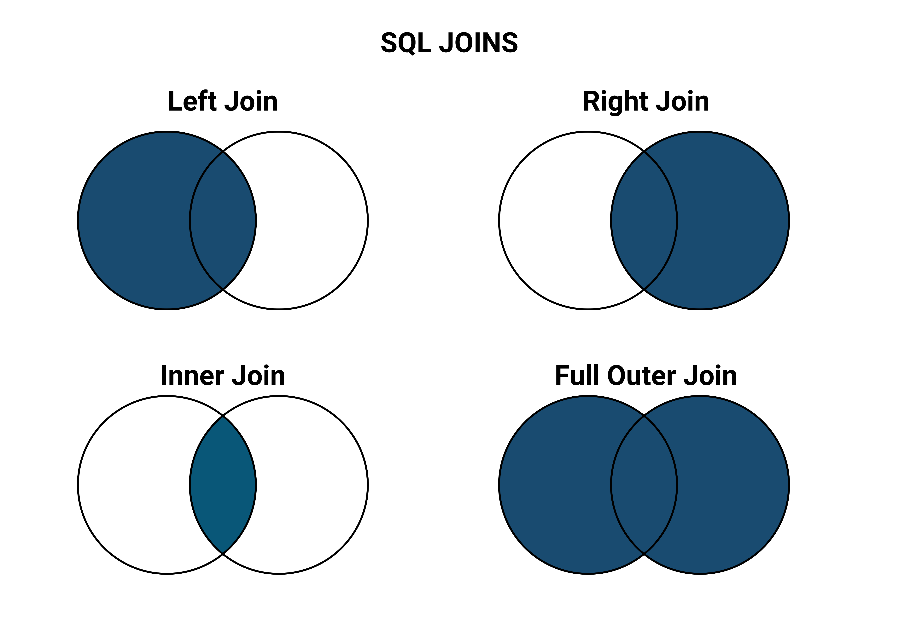
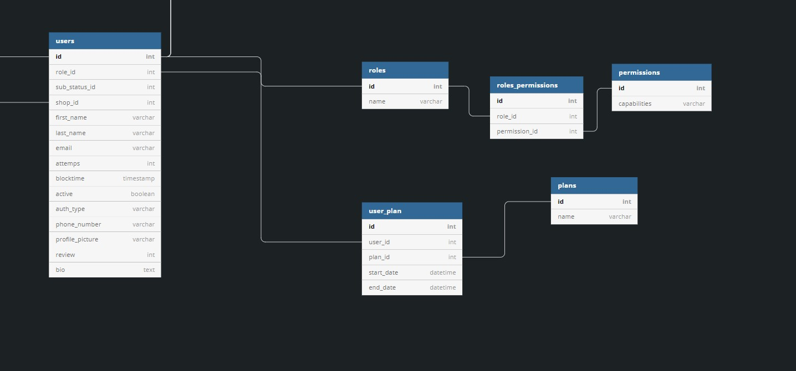

# Relational Databases

## High Level Goals

By the end of this lesson, you will be familiar with the following:

- Relational Databases
- Primary Keys
- Foreign Keys
- One-To-One Relationships
- One-To-Many Relationships
- Many-To-Many Relationships
- Joins

## What Are Relational Databases

A relational database stores and accesses data that is related. This kind of databases are based on the relational model which connects different tables by using primary and foreign keys.

### Primary Keys

A primary key is a unique identifer for every record in the table, and for every record there can only be one primary key. It can be anything from an id, licenses plate, email, or phone number, but usually it is an auto incremented id.

### Foreign Keys

A foreign key is the primary key of another table that exists in a different table and is used to form a connection in between the two tables. Depending on where the foreign key exists it will represent a different relationship type.

### Relationship types

There are three main types of relationships:

- One-To-One Relationships
- One-To-Many Relationships
- Many-To-Many Relationships

One-To-One Relationships: one example would be a relationship between an `employee` table and a `salary` table. Each user will have one salary.

One-To-Many Relationships: for example, a relationship between a `class` table and a `teacher` table. Each class has only one teacher, but teachers can have many classes.

```sql
CREATE TABLE teacher (
    teacher_id INT AUTO_INCREMENT NOT NULL,
    first_name VARCHAR(255) NOT NULL,
    last_name VARCHAR(255) NOT NULL,
    PRIMARY KEY (teacher_id)
);

CREATE TABLE class (
    class_id INT AUTO_INCREMENT NOT NULL,
    class_subject VARCHAR(255) NOT NULL,
    student_count INT,
    teacher INT,
    PRIMARY KEY (class_id),
    -- the foreign key is on the many side
    FOREIGN KEY (teacher) REFERENCES teacher(teacher_id)
);

```

Many-To-Many Relationships: an example on this type of relationships would be a relationship between a `role` table and a `permission` table. Each role has many permissions and the permissions have many roles.

```sql
CREATE TABLE role (
    role_id INT AUTO_INCREMENT NOT NULL,
    role VARCHAR(255) UNIQUE NOT NULL,
    PRIMARY KEY (role_id)
);

CREATE TABLE permission (
    permission_id INT AUTO_INCREMENT NOT NULL,
    permission VARCHAR(255) UNIQUE NOT NULL,
    PRIMARY KEY (permission_id)
);

-- join table
CREATE TABLE role_permission (
    id INT AUTO_INCREMENT NOT NULL,
    role INT,
    permission INT,
    -- both of the primary keys are set as foreign keys
    FOREIGN KEY (role) REFERENCES role(role_id),
    FOREIGN KEY (permission) REFERENCES permission(permission_id)
);
```

### JOIN SQL Statements

JOIN statements are used to combine rows from two or more different tables by using a related column between the tables.

There are different types of joins, some of them are: `inner join`, `left join`, `right join`, `full outer join`.



Inner join: selects all records with matching values in both tables.

```sql
SELECT columns FROM table1
INNER JOIN table2 ON table1.column_name = table2.column_name;
```

Left join: selects all records from the left table and the matching records from the right table.

```sql
SELECT columns FROM table1
LEFT JOIN table2 ON table1.column_name = table2.column_name;
```

Right join: selects all records from the right table and the matching records from the left table.

```sql
SELECT columns FROM table1
RIGHT JOIN table2 ON table1.column_name = table2.column_name;
```

### Entity Relationship Diagrams

ER diagrams are used to visually show the relationships between entities (tables).


