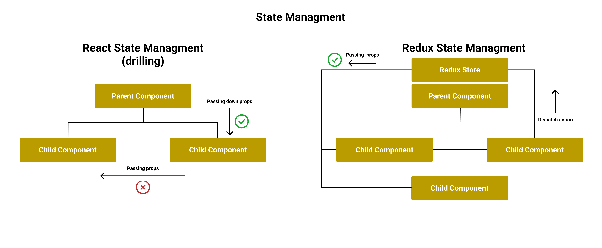
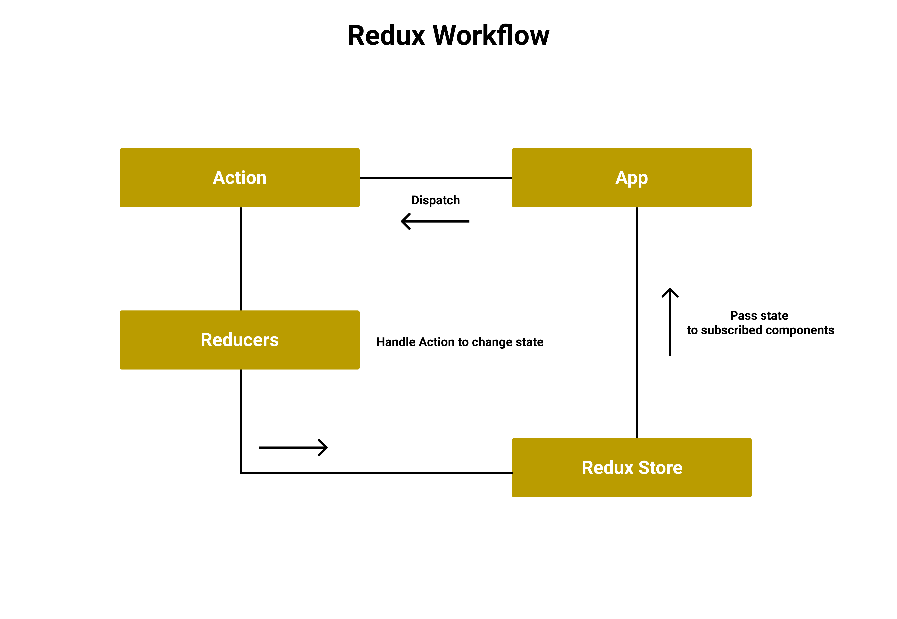

# React Redux

## High Level Goals

By the end of this lesson, you will be familiar with the following:

- Redux
- Redux principles
- React Redux

## What Is Redux

Redux is a a predictable state management tool for JavaScript applications, it can be used with react and other frontend libraries and frameworks.

### Why Learn Redux

React state management can be a headache in large applications, even though the context API solved many of the issues react used to have and can be used to completely manage the state of the application without the use of third party libraries. That said Redux is still widely used and demanded in the job market. and since redux is a general solution for many libraries and frameworks then learning how it works can be beneficial when dealing with other frontend technologies.

### Props Drilling Vs Redux



### Redux Principles

- Single source of truth: The whole application state is stored in an object tree inside a single store.

```js
// get the state tree
store.getState();
// an example of the state tree
{
  // state called todos
  todos: [
    {
      text: 'Consider using Redux',
      completed: true,
    },
    {
      text: 'Keep all state in a single tree',
      completed: false
    }
  ],
  // state called filter
  filter: 'COMPLETED'
}
```

- State is read-only: The state can only be changed by emitting (dispatching) an action (an object to describe what has changed).

```js
// dispatch method emits an object representing the action
// type: is the type of the action that needs to be handled
// payload: is the new information we pass to the reducer (new state, index, etc)
store.dispatch({
  type: "SET_FILTER",
  payload: "SHOW_NOT_COMPLETED",
});
store.dispatch({
  type: "COMPLETE_TODO",
  payload: 1,
});
```

- Changes are made with pure functions: Pure reducers are used to specify how the actions transform the state tree.

```js
import { combineReducers, createStore } from "redux";

// first reducer
// we must specify the initial state and that can be done by using the default parameters (ES6)
const filter = (state = "SHOW_ALL", action) => {
  switch (action.type) {
    case "SET_FILTER":
      return action.payload;
    default:
      return state;
  }
};

// second reducer
const todos = (state = [], action) => {
  // switch, case and default keywords are used to create conditional statements, it can be replaced with an if/else statement
  switch (action.type) {
    // incase that action.type is equal to ADD_TODO
    case "ADD_TODO":
      // return a new array to keep the function pure
      return [
        ...state,
        {
          text: action.payload,
          completed: false,
        },
      ];
    // incase that action.type is equal to COMPLETE_TODO
    case "COMPLETE_TODO":
      // map returns a new array to keep the function pure
      return state.map((todo, index) => {
        if (index === action.payload) {
          // use Object.assign to create a new object instead of mutating the original
          return Object.assign({}, todo, {
            completed: true,
          });
          // you can also use the object spread operator
          // return {
          //   ...todo,
          //   completed: true
          // }
        }
        return todo;
      });
    default:
      return state;
  }
};

// combineReducers takes an object with keys that represent the reducers
const reducer = combineReducers({ filter, todos });
// stores holds all the state for the reducers
const store = createStore(reducer);

export default store;
```



## Using Redux

Use `npm install redux react-redux` to install redux and react-redux.

- src/reducers/todos/index.js

```js
// create the initial state for the reducer
const initialState = {
  todos: [],
};
​
// create the `todos` reducer
// we have destructed the action to get the type and payload
const todos = (state = initialState, {type, payload}) => {

  switch (type) {
    case 'SET_TODOS':
      return { todos: [...payload] };

    case 'CREATE_TODO':
      return { todos: [...state.todos, payload] };

    case 'UPDATE_TODO':
      return {
        todos: state.todos.map((todo) => {
          if (todo._id === payload._id) {
            return payload;
          } else {
            return todo;
          }
        }),
      };

    case 'DELETE_TODO':
      return {
        todos: state.todos.filter(
          (todo) => todo._id !== payload._id,
        ),
      };

    default:
      return state;
  }
};
​
export default todos;
​
export const setTodos = (todos) => {
  return {
    type: 'SET_TODOS',
    payload: todos,
  };
};
​
export const createTodo = (todo) => {
  return {
    type: 'CREATE_TODO',
    payload: todo,
  };
};
​
export const updateTodo= (todo) => {
  return {
    type: 'UPDATE_TODO',
    payload: todo,
  };
};
​
export const deleteTodo = (todo) => {
  return {
    type: 'DELETE_TODO',
    payload: todo,
  };
};
```

src/reducers/index.js

```js
import { createStore, combineReducers } from 'redux';
​
// import reducers
import todos from './todos';
import login from './login';

​
const reducers = combineReducers({ login, todos });
const store = createStore(reducers);

export default store;
```

- src/index.js

```js
import React from "react";
import ReactDOM from "react-dom";
import App from "./App";
// import provider
import { Provider } from "react-redux";
// import store
import store from "./reducers";

ReactDOM.render(
  // The provider will enable the child components to access the store
  <Provider store={store}>
    <App />
  </Provider>,
  document.getElementById("root")
);
```

- src/components/Todos/index.js

```js
import React, { useState, useEffect } from 'react';
import axios from 'axios';
// import useDispatch and useSelector to dispatch and subscribe to the store
import { useDispatch, useSelector } from 'react-redux';
// import the actions
import { createTodo, setTodos } from './../../reducers/todos';
​
const TodoList = () => {
  const [todo, setTodo] = useState('');
​
  // useDispatch allows us to dispatch actions to the reducers
  const dispatch = useDispatch();
​
  // useSelector gives us access to the store
  const state = useSelector((state) => {
    // specify which state to subscribe to (state tree => reducer => state name )
    return {
      user: state.login.user,
      todos: state.todos.todos
    };
  });
​
  const createTodo = () => {
    axios.post(
      `http://localhost:3000/todos`,
      {todo},
    ).then((res) =>{
      // after saving the todo in the database dispatch an action to add the new todo to the store
      dispatch(createTodo(res.data));
    }).catch((err)=>{
      console.log(err)
    })
  };

  useEffect(()=>{
    axios.get(
      `http://localhost:3000/todos`).then((res) =>{
      // add the todos that are saved in the DB to the store when rendering and incase of refresh
      dispatch(setTodos(res.data));
    }).catch((err)=>{
      console.log(err)
    })

  },[])

  return (
  <div>
    {/* access the user from the state variable */}
    <h1> Welcome {state.user.name} </h1>
    <input  type="text" onChange={(e)=>{setTodo(e.target.value)}}/>

    <button onClick={createTodo}> Add </button>

    <ul>
    {/* access the todos from the state variable */}
    {state.todos.map((todo)=>{
        return <li>{todo.title}</li>
    })}
    </ul>
  </div>
  );
};
​
export default TodoList;
```
