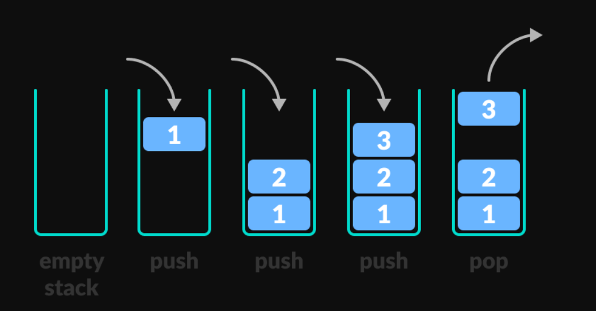

# Data Structure
## Stack Data Structure :
Stack is a linear data structure which follows a particular order in which the operations are performed. The order may be LIFO(Last In First Out) or FILO(First In Last Out).

### operations :
- `Push`: Adds an item in the stack. 
- `Pop`: Removes an item from the stack. The items are popped in the reversed order in which they are pushed. 
- `isEmpty`: Returns true if stack is empty, else false.
- `peek`: Retrieve or fetch the first element of the Stack or the element present at the top of the Stack

### Complexities
O(1)

Example :
Stack is used browser back button

