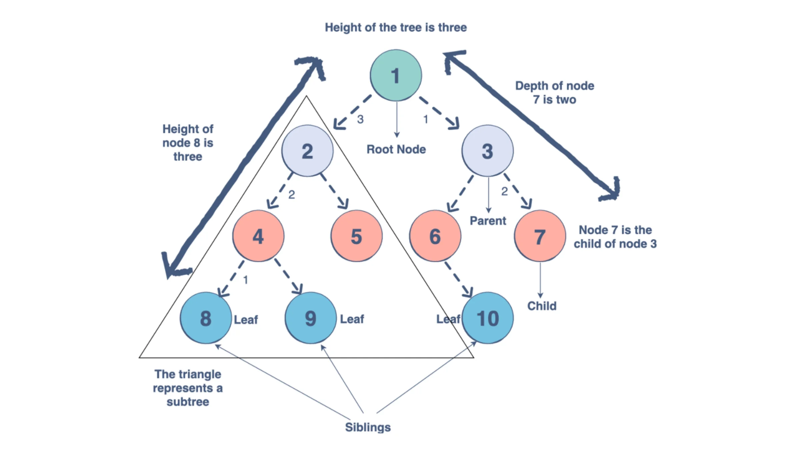

# Data Structure
## Tree :
**Trees** are non-linear data structures represented as a collection of nodes connected by edges. Each node stores data of any type.

**Tree** data structures are typically used to store information while preserving its hierarchy, for implementing quick searches, networking, and inheritance.

### The basic components of a tree includes:

- The **root**, which is the top-most node (it has no parent node). This is typically the starting point of your tree.
- The **parent node**, which is connected downwards to one or two nodes.
- The **child node**, which has an incoming link (or connecting edge) from a parent node above it.
Sibling nodes are nodes that share the same parent.
- The **leaf nodes** have parent nodes but no children nodes. They are typically the base/bottom nodes.
A subtree is a tree held within a larger tree.
- The **degree** of a node refers to the number of subtrees within a tree.
- The **depth** of a tree refers to the number of edges between a specific node and the root.
- The **height** of a node refers to the number of edges in the longest path from a specified node to a leaf node.

### Traverse trees
A traversed tree is one in which every node on the tree has been visited. Traversal is a process involving iterating over all nodes in a certain manner.

Unlike linear data structures (such as **Arrays**, **Linked** **Lists**, or **Queues**) which have only one logical way to traverse them with recursion, trees can be traversed in different ways. Generally there are 2 iterative ways for traversing trees:

- Depth-first Search/Traversal (**DFS**)
- Breadth-first Search/Traversal (**BFS**)

**Tree** data structures have many applications such as:

- Maps
- Sets
- Databases
- Priority Queues
- Querying an LDAP (Lightweight Directory Access Protocol)
- Representing the Document Object Model (DOM) for HTML on Websites.

### Here are some important points of trees:
- The tree is a data structure where a node has 0 or more descendants/children.
- Tree nodes don’t have cycles (acyclic). If it has cycles, it is a Graph data structure instead.
- Trees with two children or less are called: Binary Tree
- When a Binary Tree is sorted so that the left value is less than the parent and the right children is higher, then and only then we have a Binary Search Tree.
- You can visit a tree in a pre/post/in-order fashion.
- An unbalanced has a time complexity of O(n). ‍
- A balanced has a time complexity of O(log n). 