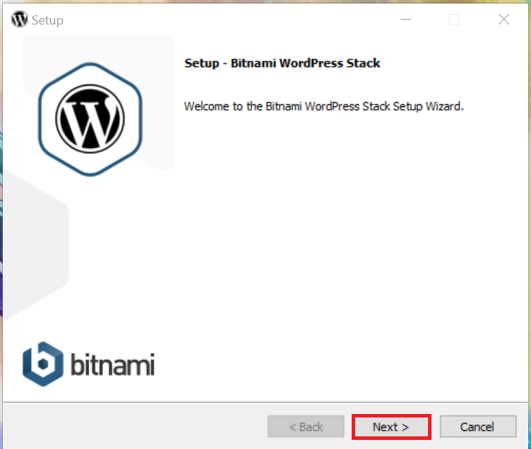
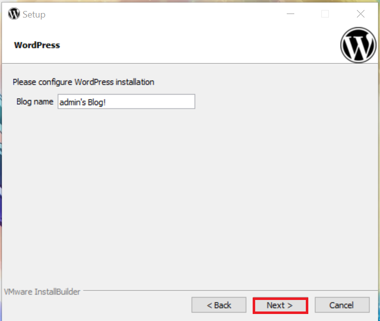
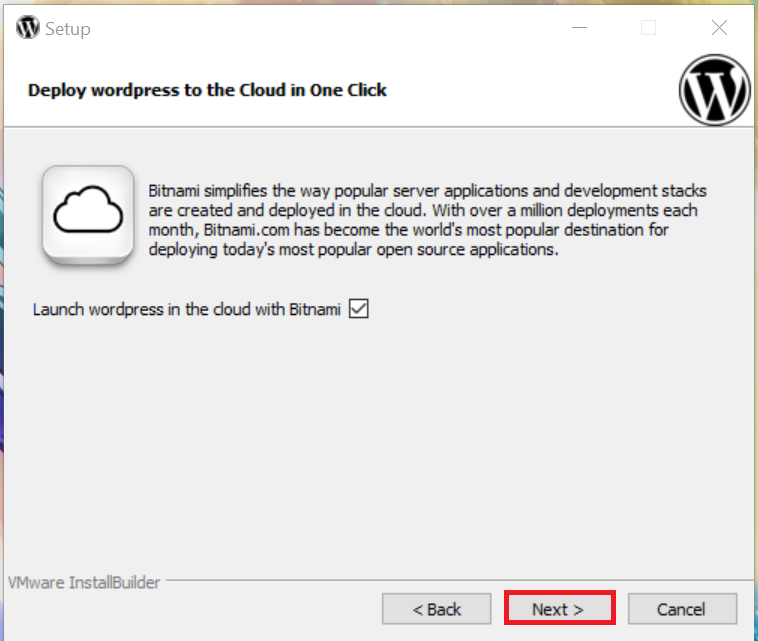
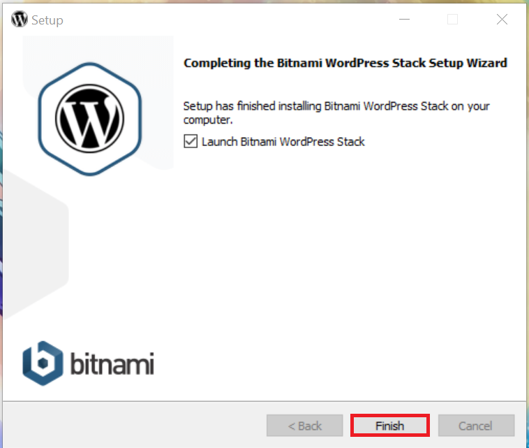
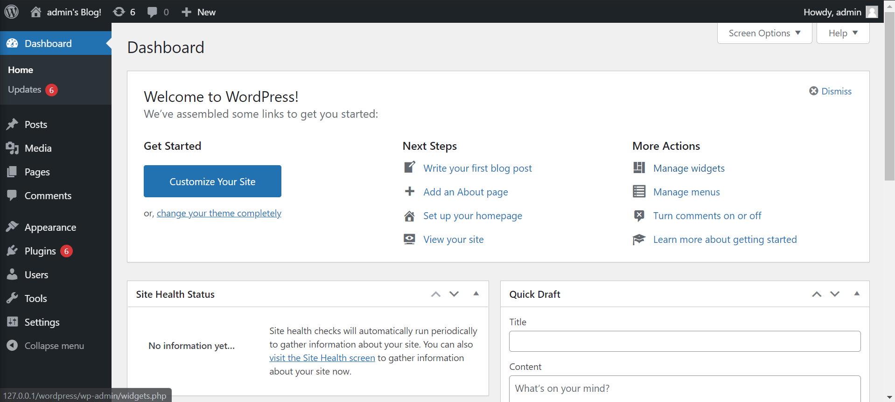
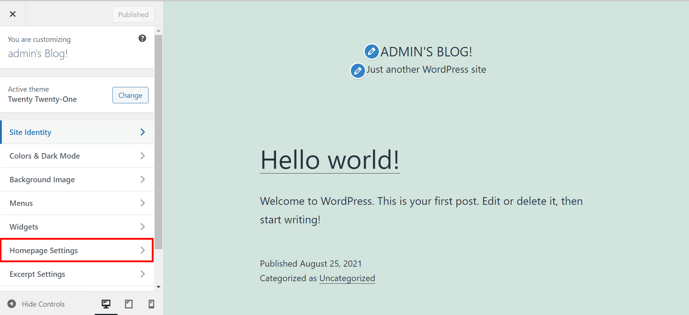

# **WordPress**

**High-Level Goals**

By the end of this lesson, you will be familiar with the following:

- WordPress setup
- Plugins
- Customize the website
- Add products

# **What is WordPress**

It&#39;s the simplest, most popular way to create your own websites. WordPress powers over 40% of all the websites on the internet.

WordPress is an open-source CMS (content management system), anyone can use or modify the WordPress software for free.
A CMS is a tool that makes it easy to manage important aspects of the website like content, without needing to know anything about programming.

# **WordPress Bitnami Setup**

First things first, we need to download WordPress using this **[LNIK](https://bitnami.com/stack/wordpress/installer)**, make sure to download a compatible version to your software, once you click download the file will start downloading automatically.

Click on the downloaded file, and follow these **STEPS**:

It's a critical step here so make sure to fill in your information correctly and set a password you can easily remember.

Then just keep clicking next till the setup starts downloading, a window like that should appear.

Once it is finished click on **Access WordPress** and a personal blog page will appear with the **username** you entered on the setup of the WordPress.

Change the **URL** from **[http://127.0.0.1/wordpress/](http://127.0.0.1/wordpress/)** to **[http://127.0.0.1/wordpress/login](http://127.0.0.1/wordpress/login)**

So you can sign in to the admin dashboard and start customizing your website, now enter the **username** and the **password** you set on the setup process.

Then will take you to this dashboard, it&#39;s where the magic begins.

Let&#39;s update the plugins and start working.

# **WordPress Plugins**

Plugins are designed to perform a specific set of functions or add features.

There are more than 55,000 WordPress plugins available to install on your site, choose whatever is suited to your website from photography, eCommerce, newsletters, and any other aspects that will help run your site more efficiently.

Now lets setup our plugin, for this tutorial we will make an eCommerce website so we will use a related plugin to do so, and one of the most famous plugin in WordPress is the **WooCommerce** plugin.

To add a new plugin to your website click on **Plugins** on the left sidebar of the dashboard.

Then click on add new.

On the **Search** box type **WooCommerce**.

Select the first one and click **Install Now**.

Once it&#39;s downloaded click on **Activate**.

It will open this window with its 5 steps make sure to fill them all to get the best out of this plugin, but you don&#39;t have to fill in your real information.

Once you reach the fifth step the **Theme** one, choose to **Skip this step** or skip it from the start.

# **Customize The Website**

Now that everything is set and ready to use, let&#39;s start customizing the website.

Please do put in mind that WordPress is basically a drag and drop tool so there is no need to use any sort of code however, you can add a custom CSS code to your elements.

On the left sidebar click on **Pages** and select **Add New** to customize the page as you wish using the tools WordPress offers and once you are done click on Publish so it can be saved, you can also click on **Preview** to see how your page would look before saving it.

After finishing the pages you want to add to your website click on **Home** on the left sidebar

Then select Customize Your Site.

You can start working on the page layout and elements, also you can add the pages you made earlier.

For example, once you start customizing the first thing you will be editing is the home page, you can edit it or completely change it to another page you built earlier, to do so click on **Homepage Settings** on the left sidebar.

Then, under the **Your homepage displays** select the **A static page** option this will reveal two drop-down lists so you can select from.

Under the **Homepage** drop-down select the name of the page you want to replace the home page with then select **Publish** this will automatically change the selected page to your new homepage.

Make sure to click on **Publish** after any made changes so it can be saved.

# **Add Products**

To start adding products to your website click on **Products** on the left sidebar from the admin dashboard, then select **Add New**.

Fill in the fields of Product Name and Description, then scroll down to the **Product data** section add price and a discount price if you like, then add a product image, categories, and tags, customize it the way you please, click on finish once you are done.

Check the added products on the **All Products** section, all the added products will automatically appear on the **Shop page** , but you can always choose where to display them.

# **Pulse Check**

1. Follow the setup steps and open WordPress locally on your device.
2. Customize the website, choose a logo and website identity.
3. Customize at least 3 new pages and add them to your website.
4. Customize at least 5 products and display them on the website.
